# Pumpkin Panic v2: what changed and how to use it

Written 6 October 2026 for Kieran. Plain English, step by step.

**Read this first.** Everything in v2 was built and tested **offline** (more than 1,100 automatic tests, plus picture renders of the lobby and maps). Nobody has pressed Play on it in Roblox Studio yet. So the first job is to update, open Studio, press Play and run `/verify-v2` in Claude Code (see [Test in Studio](#test-in-studio)).

The pictures below are renders made from the game's own code, not Studio screenshots. Studio will look a little different (better lighting, cobwebs and rope lines show).

Words used on this page:
- **Config**: the settings files in `src/shared/Config/`. Every number, name and price is there.
- **Feature switch**: a `true`/`false` line in `src/shared/Config/Features.luau` that turns one feature on or off.
- **Tag**: a label on a part in Studio (Properties > Tags). The game finds the parts that *do* something by their tag, so you can move them freely.
- **Attribute**: a small named value on a part or model (Properties > Attributes).
- **Commit**: one saved step in git's history, with a short id like `d9df1ab`.

---

## Contents
1. [What's new](#whats-new)
2. [First time after updating](#first-time-after-updating)
3. [Turn a feature off](#turn-a-feature-off)
4. [Undo a feature completely](#undo-a-feature-completely)
5. [Change it](#change-it)
6. [Make it look like yours](#make-it-look-like-yours)
7. [Robux setup](#robux-setup)
8. [Test in Studio](#test-in-studio)
9. [Known limits](#known-limits)

---

## What's new

### The Pumpkin Vendor is back (and can't vanish again)
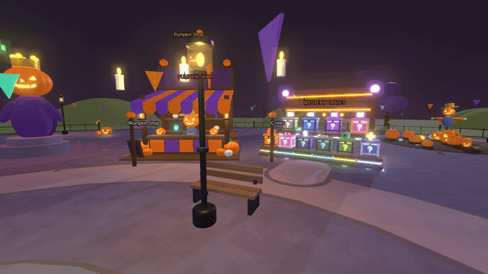

**Why it vanished.** I couldn't see your place file, so I checked every way the vendor could disappear. Two causes fit:
1. **An old saved lobby.** The lobby saved in your place was used exactly as it was. If the vendor had been deleted, moved out of the lobby or ungrouped in Studio (or the lobby was saved before a rebuild), nothing ever put it back.
2. **A custom vendor model.** A model named `PumpkinVendor` in `ReplicatedStorage > Custom > Characters` always replaced the built shopkeeper, even if it was invisible, too small (hidden behind the counter), turned on its side, or standing somewhere else after the stall was moved. Its name tag also sat under the stall's roof, so you couldn't see it from the ground.

**How it's fixed.**
- The shopkeeper and its "Shop" button carry the tag `ShopKeeper`. Every time the game starts, it checks for a `ShopKeeper`. If there isn't one, it builds the shop again and says so in the Output window. This works even on a lobby you have Locked (see below).
- The spawn (tag `HubSpawn`) and the Ready pad (tag `ReadyPad`) are protected the same way.
- A custom vendor model is only used if it passes three checks: you can see it, it is about the right height, and it stands tall enough to be seen over the counter. If it fails, the built shopkeeper stays and the Output window says why.
- The name tag is on a fixed spot above the roof and always draws on top.
- The vendor is now the **Pumpkin Shop**: a big striped stall with shelves and a sign. Talking to it opens the Skins tab.

### Witch Wanda, the Boo Guide and the tutorial are gone
- The Pumpkin Shop is the only shopkeeper.
- Old copies of Witch Wanda and the Boo Guide are deleted from a saved lobby automatically when the game starts.
- The first-round tutorial pop-ups are switched off. The code is kept, so you can bring them back with one line (`Tutorial = true` in `Features.luau`), but you don't need to.

### Ready pad: nobody is pulled into a round
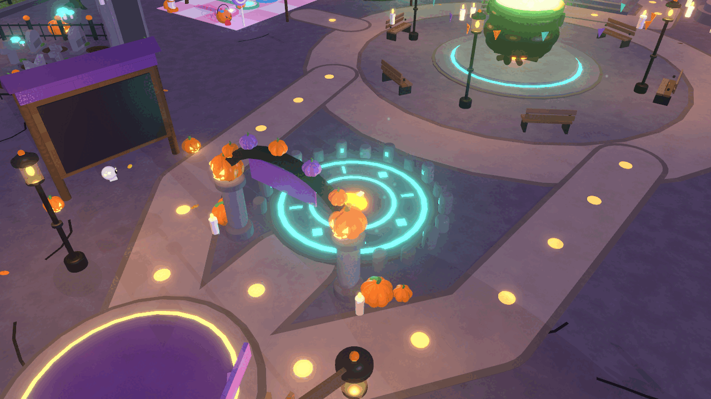

- You appear on a round stone that says **BOO!**, facing a glowing rune circle under a pumpkin arch. That circle is the **Ready pad**.
- Stand on it to say "I want to play". The floating sign shows **READY 1 / 2** and so on.
- When enough players are ready, the vote opens. Only ready players can vote.
- Everyone else stays in the lobby: shop, crates, parkour, minigames. They can watch the round with **Menu > Spectate** (or the "Watch the round" button).
- After a round, everyone comes back to the lobby spawn. To play again, step on the pad again.

### Three game modes and five maps
The vote offers three random **playlists**. A playlist is one mode on one map. Only playlists that fit the number of ready players are offered.

| Mode | How to play | Maps | Players |
| --- | --- | --- | --- |
| **King Hunt** (the original) | Grab pumpkins, stay quiet, don't get caught by the Pumpkin King | Haunted Pumpkin Patch, Spooky Mansion | 1+ |
| **Pumpkin Hide & Seek** (new) | Hiders turn into pumpkins and hide among the decoys. Seekers count in a hut, then come out with **candy guns**. A candy that hits a hider tags them, and they join the seekers. Hiders giggle every 20 seconds and glow in the last 30 seconds, so they are fairly easy to find. | Pumpkin Farm, Hedge Maze | 2+ |
| **ScareMaze** (new) | Survivors run through a cornfield maze to the green exit. Stand still for 3 seconds and you're OUT. Haunters press **BOO** to scare them. Scarecrows, zombies, bats and ghosts jump out of hidden traps. | ScareMaze | 2+ (Haunters from 3 players) |

| King Hunt: Haunted Pumpkin Patch | King Hunt: Spooky Mansion |
| --- | --- |
| 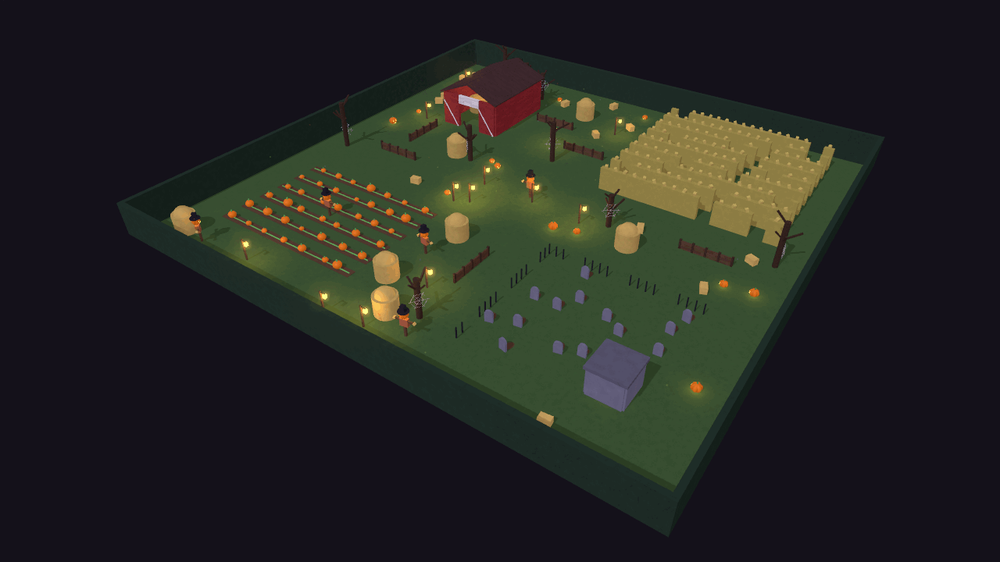 | 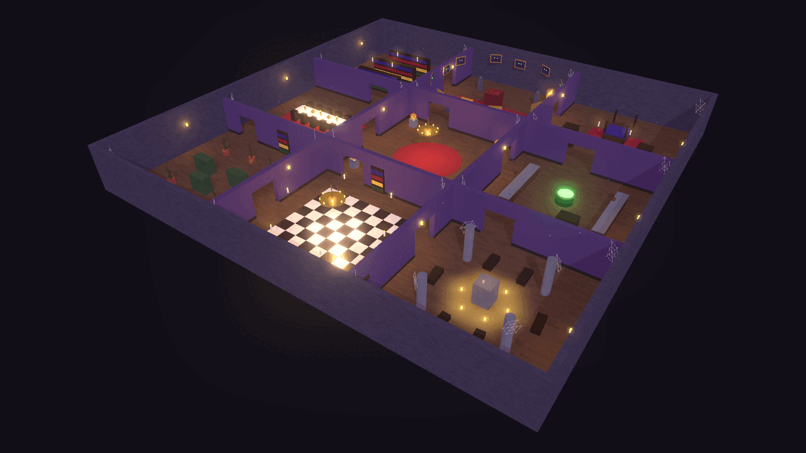 |
| **Hide & Seek: Pumpkin Farm** | **Hide & Seek: Hedge Maze** |
| 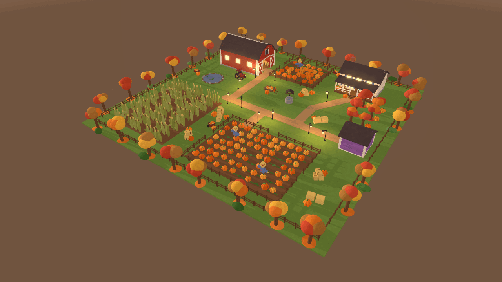 | 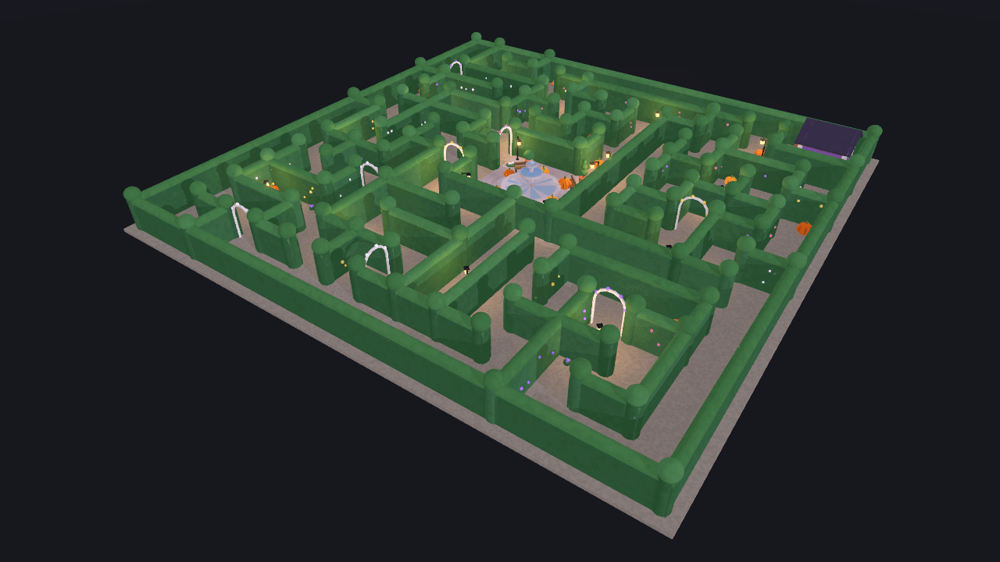 |
| **ScareMaze** | **ScareMaze, from the ground** |
| 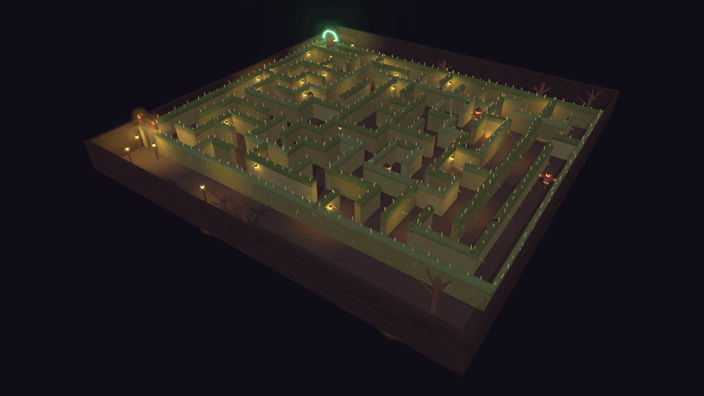 | 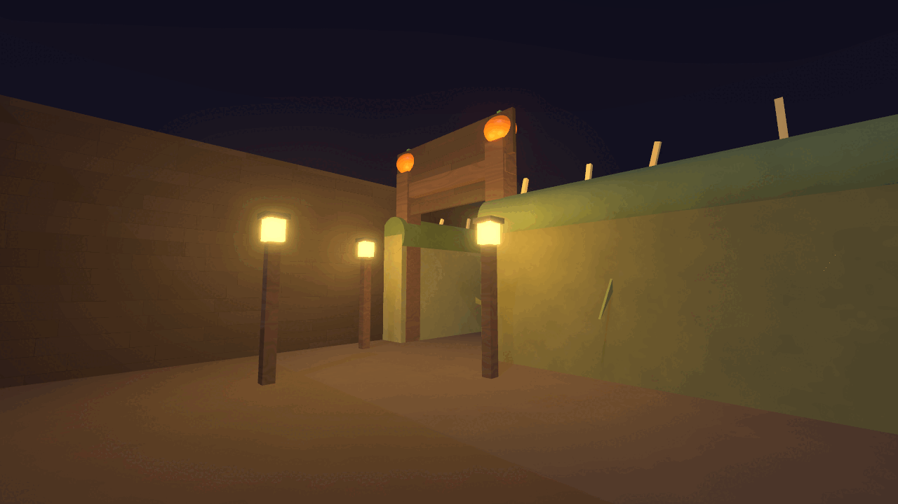 |

Fair-play rules that were added after review:
- A Hide & Seek hider who resets leaves their pumpkin where it was (it can still be tagged) and comes back to it.
- Lobby spectators can't watch hiders, and chat bubbles are hidden during a round, so nobody can give hiding spots away.
- ScareMaze and parkour check for teleporting and flying. A cheater is put back where they were.

### Lobby redesign
| Before | After |
| --- | --- |
| 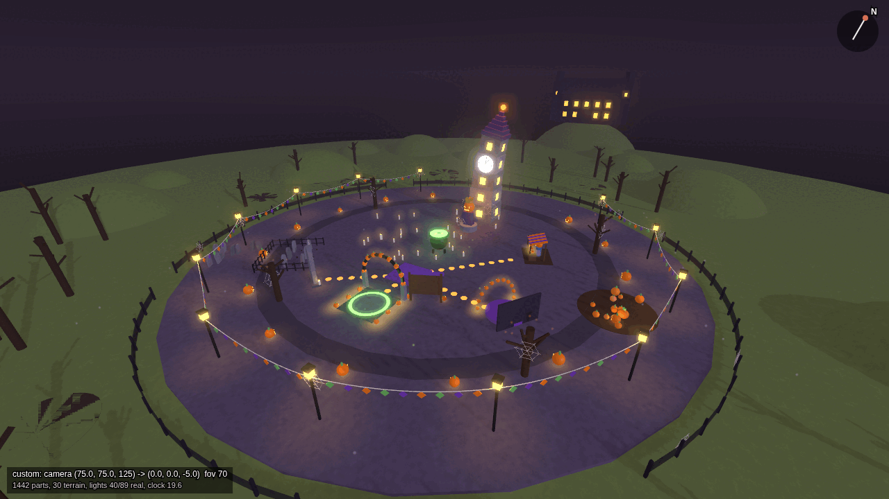 | 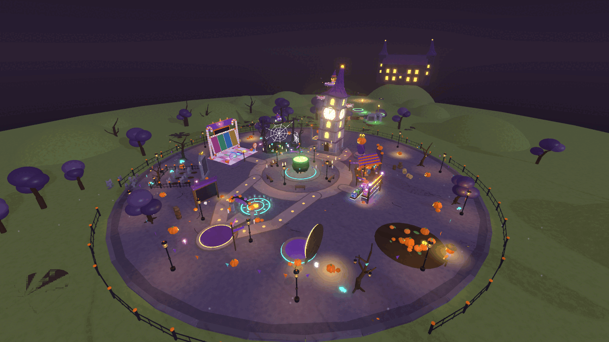 |

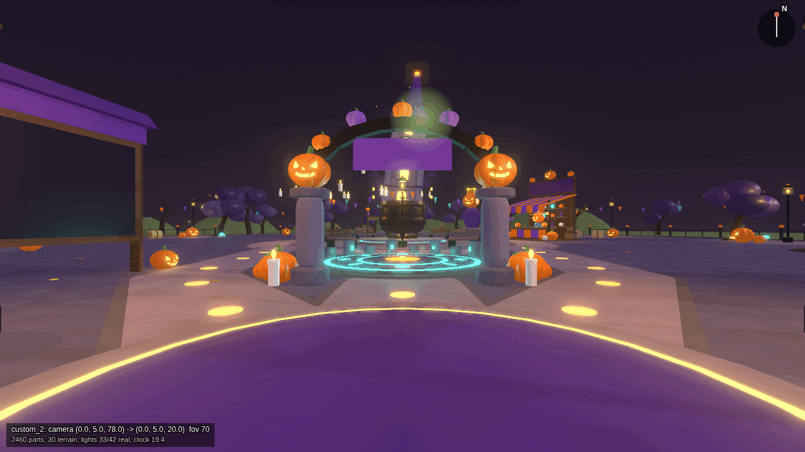

- Real rounded shapes instead of squashed blocks: ribbed pumpkins with carved faces, puffy trees, rounded lampposts.
- A town square layout: the spawn in the south, the Ready circle in front of it, the cauldron in the middle, the crooked clock tower in the north.
- Curving stone paths and signposts lead to every area that is switched on.
- Every area has its own space (a **zone**), so decorations never block it.
- A glowing sign lies on the ground in front of each area (READY? STEP IN!, PUMPKIN SHOP, MYSTERY CRATES, CANDY RUSH, WEB SCOUR, PARKOUR), readable from far away.
- The lobby is solid: trees, lampposts, benches, gravestones, crates, stalls, statues and big pumpkins can't be walked through, and nothing you stand on lets you fall through. Paths, area entrances and the Ready pad stay clear.
- The Photo Spot has 10 spooky dances (Zombie Shuffle, Skeleton Rattle, Ghost Float, Pumpkin Head Spin, Monster Mash, Bat Flap, Scaredy Cat Shiver, Witchy Cackle, Mummy Wobble, Spooky Floss) that everyone can see. Walk or jump to stop.
- Dusk lighting with a big moon, stars, clouds and soft haze.
- Every lobby area is its own Model with readable names, so it is easy to edit by hand (see [Make it look like yours](#make-it-look-like-yours)).

More views: [from the top](screenshots/lobby-top.png).

### Parkour: "Spooky Sky Climb"
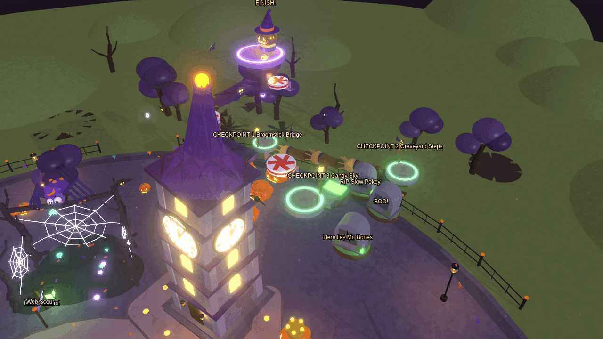

- Behind the clock tower. About 60 jumps in 8 stages, spiralling up: Pumpkin Hop, Broomstick Bridge, Graveyard Steps, Candy Sky, Bat Wings, Crypt Lids, Lantern Leap and Moonlight Summit. Super easy at the start, only a little trickier at the top, with wide broomsticks.
- Start on the START pad. The timer starts when you jump off it.
- Touch the 7 checkpoints in order (one at the start of every stage). Fall (or touch green slime) and you go back to your last checkpoint, never all the way down.
- Everything on the course you can see is solid: you bump into gravestones, their dirt mounds, crypts, candies and bats instead of walking through them. Only glow, words, moss and slime are walk-through.
- Reach the golden trophy pumpkin at the top: **300 coins**, at most once every 20 hours. Your best time is saved and shown on a board.
- **Menu > Parkour** shows your best time, when coins can be won again, and a "Go to start" button.

### Tormented Tower
- The crooked clock tower is now hollow, with a REALLY hard climb inside for the bravest players. Walk in through the doorway (a glowing "TORMENTED TOWER - only the bravest" sign lies in front of it).
- About 24 jumps up to the clock face: tiny posts, narrow beams, trusses to climb, platforms that vanish, spinning bars that knock you off, turning cogs, slime, and long jumps that need sprinting. Only 3 checkpoints.
- Checked by the server like the lobby parkour: checkpoints in order, falls send you back, no teleporting, and a too-fast finish doesn't count. Your best time is saved.
- Beat it once to win the **Tormented Soul** skin (CRAZY, with its own swirl of ghostly chains and red lightning). It's never sold and in no crate. Every finish tells the whole server "<name> conquered the Tormented Tower!".
- **Menu > Tormented Tower** shows your best time and takes you to the tower.

### Candy Rush
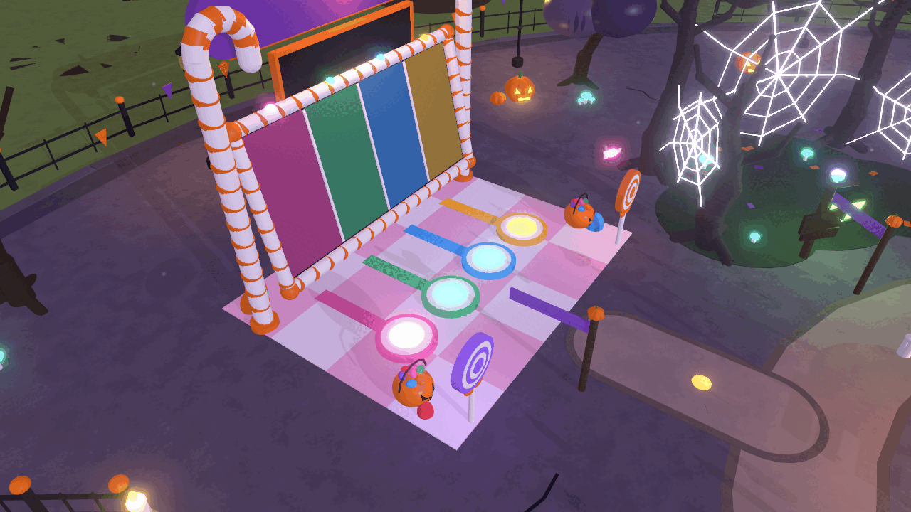

- A candy stand on the west side of the lobby. Stand on one of the coloured pads in front of the big board.
- With 2 or more players on pads: 3-2-1, GO! Candies pop up one at a time in your lane. Click (or tap) **your** candy. The first to grab 10 wins.
- Coins: 25 for the winner, 5 for everyone else who finished. At most once every 15 seconds and 300 a day.
- Waiting alone for 6 seconds starts a solo "beat your time" run (5 coins).

### Web Scour
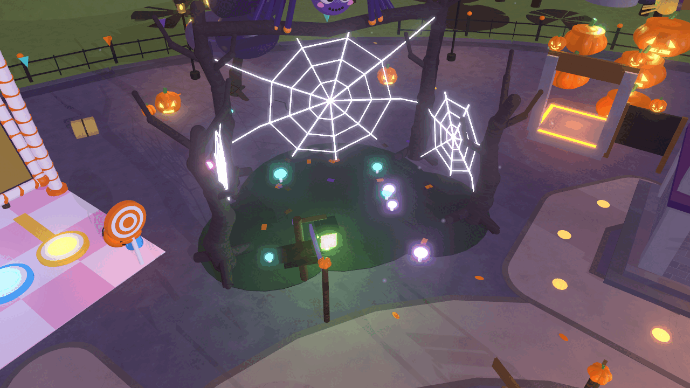

- The **Spider Grove**: twisted trees full of cobwebs. Walk to the glowing lantern and press **Scour the Web!**
- 6 cute cartoon spiders in bright colours hide on the web strands (never on the floor or a tree). Only you can see yours. Click or tap them all within 45 seconds.
- Coins: 2 per critter, 20 more for finding them all, plus a bonus for time left (never more than 50). Coins at most once every 3 minutes. That wait is saved, so changing servers doesn't skip it.

### Secret pumpkins (Easter eggs)
No picture: they are hidden on purpose.
- 11 secret pumpkins, candies, a lollipop, skulls and ghosts are hidden around the lobby. Each gives coins **once per player, ever**: from 25 to 100, about 545 in all.
- Your example is in: the pumpkin **behind the shop gives 50 coins**.
- One sits on the parkour trophy (100 coins), one in the haunted mansion on the hill (100).
- Walk into one, or use its button.
- **Menu > Secret Pumpkins** lists the ones you found and a riddle for each one you haven't.

### Rarity prices
- Every shop item has a rarity. The price comes from the rarity: **Common 125, Uncommon 500, Rare 1,000, CRAZY 100,000** coins.
- Each pumpkin you collect in King Hunt is worth **5 coins**.
- Shop cards show a coloured rarity tag. VIP items are still free with VIP.

### 630 skins and 34 crates
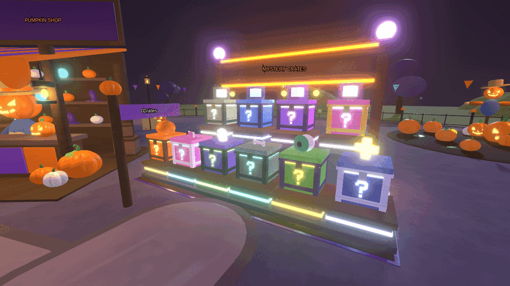

- **About 630 skins**: the 6 classic skins, 120 crate skins in the 6 classic themes (Pumpkin, Candy, Spooky, Graveyard, Monster, Moonlight: 12 Common, 5 Uncommon, 2 Rare, 1 CRAZY each) and 507 more in 24 new themes (Vampire Castle, Zombie Town, Haunted Carnival, Mummy Tomb, Werewolf Woods, Mad Scientist Lab, Ghost Ship, Bat Cave, Spider Lair, Skeleton Crew, Cursed Toys, Scarecrow Farm, Haunted Hotel, Monster Disco, Black Cat Alley, Goblin Market, Swamp Creatures, Witch's Brew, Alien Abduction, Frosty Fright, Graveyard Party, Candy Factory, Phantom Theatre, Autumn Leaves: 13 Common, 5 Uncommon, 3 Rare each), with 18 new head pieces. No two skins look the same.
- **Exactly 10 CRAZY skins**: the six classic ones, the Tormented Tower's, and three **ONE IN A MILLION** skins (Night Lord Supreme, Disco Demon, Star Voyager): a 0.0001% chance in their own crate, each with its own animated effect (a blood moon with bats, a disco ball with light beams, a flying saucer beaming you up). Unboxing any CRAZY skin is announced to the whole server, with an extra-big rainbow banner for the one-in-a-million ones.
- The rarer the skin, the fancier it looks. Common: colours, materials and patterns. Uncommon: plus a head piece. Rare: plus a glow and floating particles. CRAZY: plus a rainbow shimmer and pieces orbiting around you.
- The Skins tab has pages and filters (owned, rarity, and a theme dropdown with all 30 themes).
- **34 crates** in **Menu > Crates**, on tabs (Classic, Monsters, Haunted Places, Creepy Critters, Sweet & Silly, By Rarity) with pages. The **MYSTERY CRATES** stand next to the Pumpkin Shop shows the 6 classic ones and the rarity crates.
  - 30 themed crates (one per theme), 600 coins each (doubled).
  - 4 rarity crates: Common 100, Uncommon 400, Rare 800, CRAZY 80,000 coins (just under the shop price of their rarity).
- **Odds** for every themed crate: Common 73.48%, Uncommon 24%, Rare 2.5%, CRAZY 0.02% (Rare and CRAZY are rarer than before). Skins of the same rarity share that chance equally.
- **Odds preview**: before you open a crate, the panel shows every skin in it and its exact chance. Roblox requires this for paid random items.
- **Open x1, x5 or x10**: the server rolls them all at once and takes the coins in one go. A strip of cards spins and slows down on each skin; **Space** (or **Skip**) jumps to the result and then to the next crate. **Quick open** skips the strips and shows every result on one page, the best one highlighted. The server picks the skins before the animation starts, so they're yours even if you close the panel.
- A skin you already own ALWAYS gives coins back ("Duplicate! +X coins back": 60, 250, 500 or 50,000 by rarity).
- **Robux crates**: each crate can also be bought with Robux once you paste its product id into Config (see [Robux setup](#robux-setup)). Until then its Robux button says "Coming soon".
- **The region rule**: in some countries, Roblox doesn't allow paid random items. The game asks Roblox about each player (this is called `PolicyService`). Those players can't open **any** crate, even with coins, because coins can be bought with Robux. They see a short message and can still buy every skin straight from the Shop at its rarity price. In Studio, crates stay open so you can test them.
- Every crate skin is also for sale directly in the Shop at its rarity price.

### Top-left Menu
No picture yet: you'll see it the moment you press Play.
- One orange **Menu** button in Roblox's own top bar, next to the Roblox and chat buttons (so the chat window can't cover it). On a keyboard, press **M**.
- It opens a grid of tiles: **Skins, Shop, Crates, Vote, Spectate, Invite, Codes, Settings, VIP & Packs, Parkour, Secret Pumpkins**. A tile only shows while its feature is on.
- The old column of Shop / Codes / Invite / Settings buttons moved into the Menu, so the screen is clear. **B** still opens the shop.
- Only one panel is open at a time. Escape closes it.

---

## First time after updating

Do these once, in this order.

### 1. Get the new code
1. Open VS Code with your project.
2. Open a terminal that is **not** running Rojo: **Terminal > New Terminal**. (Rojo keeps its own terminal busy.)
3. Make sure you are in the repo folder (the `Janus` folder), then type:
   ```powershell
   git pull
   ```
   This downloads every v2 change. If it complains about "local changes", stop and ask Claude Code: "git pull says I have local changes, help me keep them".
4. Install the updated tools (the test runner, Lune, has a new version):
   ```powershell
   cd new-game
   rokit install
   ```

### 2. Reconnect Rojo
1. Go to the Rojo terminal. Press **Ctrl+C** to stop it, then start it again inside `new-game`:
   ```powershell
   rojo serve
   ```
   Restarting matters: v2 adds a new synced folder (`maps/` becomes `ServerStorage > Maps`).
2. In Studio: **Plugins > Rojo > Connect**. Accept the changes it shows.
3. Restart Claude Code (Ctrl+C twice, then `claude`), so it sees the new slash commands like `/verify-v2`.

### 3. The lobby rebuilds itself once
Every lobby the game builds carries a version number: the attribute **BuildVersion** on `Workspace.Hub`. The code's number is `Config.Hub.BuildVersion` (now 5). When the lobby saved in your place has a lower number (or none, like your old one), the game builds the new lobby automatically when you press Play.

What that means for you:
- **If you never changed the old lobby by hand:** nothing to do. You get the new lobby.
- **If you moved or changed things in the old lobby:** those changes are replaced by the new lobby. They are gone in the game. Re-do them on the new lobby (it's a different layout, so most old edits wouldn't fit anyway), then **Lock** it so it is never rebuilt again. Steps are in [Make it look like yours](#make-it-look-like-yours).

To make the new lobby part of your place (so you also see it while editing, not only while playing):
1. Stop the game (edit mode).
2. Optional backup of the old lobby: in the Explorer, right-click `Workspace > Hub` > **Save to File...**
3. Open **View > Command Bar**, paste this and press Enter:
   ```lua
   require(game.ServerScriptService.Server.Tools.Bake).Hub()
   ```
4. Save the place (**Ctrl+S**).

### 4. Turn on nice lighting (once)
In the Explorer, click **Lighting**. In the Properties window, set **Technology** to **Future**. Scripts are not allowed to change this, so it has to be done by hand. It makes the lamps, lanterns and candles glow with soft light. Save the place.

### 5. Press Play and look for these
- You spawn on the round **BOO!** stone, facing the pumpkin arch and the glowing Ready circle.
- The **Pumpkin Shop** stall is there, with its shopkeeper. Its prompt opens the Skins tab.
- The orange **Menu** button is in the top bar at the top left. **M** opens it.
- No Witch Wanda, no Boo Guide, no tutorial bubbles.
- Step on the Ready circle: the sign says **READY 1**, the vote opens, a round starts.
- The **Output** window (View > Output) has no red errors. These yellow or white messages are fine:
  - `[CrateService] PolicyService didn't answer for <your name>; crates stay open in Studio only.` (Roblox's region check often doesn't answer in Studio.)
  - `[HubService] ...` notes saying something was missing from your saved lobby and was put back, or that old NPCs were removed.
- Not fine: anything red, `[Main] ... failed to start`, or `[HubService] Building the hub failed`. Copy it into Claude Code.

Then run the full check: [Test in Studio](#test-in-studio).

---

## Turn a feature off

Something broken, or you just don't want it? Open `src/shared/Config/Features.luau`, change `true` to `false` on its line, and save. Rojo syncs it; press Play again. Everything else keeps working. Change it back to `true` to bring it back.

| Feature | The line in `src/shared/Config/Features.luau` |
| --- | --- |
| Ready pad (off = everyone in the lobby plays every round) | line 13: `ReadyPad = true,` |
| Watching the round from the lobby (Menu > Spectate) | line 14: `LobbySpectate = true,` |
| Top-left Menu (off = the old column of buttons comes back) | line 15: `Menu = true,` |
| King Hunt mode | line 16: `KingHunt = true,` |
| Pumpkin Hide & Seek mode | line 17: `HideSeek = true,` |
| ScareMaze mode | line 18: `ScareMaze = true,` |
| Parkour course | line 19: `Parkour = true,` |
| Candy Rush | line 20: `CandyRush = true,` |
| Web Scour | line 21: `WebScour = true,` |
| Tormented Tower | line 22: `TowerParkour = true,` |
| Photo Spot dances | line 23: `Dances = true,` |
| Secret pumpkins (Easter eggs) | line 24: `EasterEggs = true,` |
| Crates (all of them) | line 25: `Crates = true,` |
| Robux crates only (coin crates stay) | line 26: `RobuxCrates = true,` |
| CRAZY skins' animations (rainbow, orbiting pieces, pulsing glow) | line 27: `SkinEffects = true,` |
| The old first-round tutorial (already off) | line 28: `Tutorial = false,` |

Good to know:
- A switched-off lobby area (parkour, Candy Rush, crates, Ready pad) is taken out of the running game. Your saved place still has it, so switching it back on brings it back.
- Signposts and paths pointing at a switched-off area stay until the lobby is rebuilt (F8 > Rebuild hub, or `Bake.Hub()`).
- With every mode switched off, King Hunt still plays, so a round can always start.
- These have no switch: the lobby redesign, rarity prices and the crate skins. Change their numbers in Config (see [Change it](#change-it)) or undo them (next section).

---

## Undo a feature completely

**Prefer the off switch above.** It is instant, safe, and easy to undo. Only remove code when you are sure you never want a feature.

### Undo one feature
Each feature was added to the main line as one **merge commit**: one commit that brought in all of that feature's work at once. `git revert` makes a **new** commit that does the opposite of an old one. Nothing is deleted from history, so you can always change your mind (revert the revert).

Type this in the VS Code terminal, inside the repo folder:
```powershell
git revert -m 1 <hash>
```
- `<hash>` is the id from the table below, e.g. `git revert -m 1 d9df1ab`.
- `-m 1` is needed because a merge commit has two "parents". `-m 1` means: keep the main line (parent 1) and take away what the feature branch brought in.

| Feature | Merge commit | Notes |
| --- | --- | --- |
| Parkour | `d9df1ab` | |
| Candy Rush | `2a5f51c` | |
| Web Scour **and** secret pumpkins | `0dc05c7` | Both came in one merge |
| Pumpkin Hide & Seek (+ Pumpkin Farm, Hedge Maze) | `0e8e59b` | |
| ScareMaze (+ its maze map) | `43ee070` | |
| Crates | `3a836ec` | |
| The 120 crate skins | `adf2b84` | Undo Crates first: crates need the skins |
| Lobby redesign | `6159f2b` | Every lobby area sits on top of it |
| Top-left Menu | `710d3a1` | Most panels now live in the Menu |
| Lobby editing (Bake, Locked, tags, Pumpkin Vendor fix) | `fefc149` | Not recommended: brings the vanishing vendor back |
| Modes, Ready pad, playlist vote, spectating | `9aa6117` | Not recommended: everything after it depends on it |
| Review fixes (modes, lobby, phone layouts, saves) | `7fd339d`, `d863ef3`, `e3fad23`, `f190fcd` | Not recommended: these fix real bugs |

A few things to expect:
- Later commits (the "integrate" commits and the review fixes) touched the same files, so git may stop with a **conflict**: two changes to the same lines that git can't combine by itself. Easiest: ask Claude Code instead of typing the command: *"Undo Parkour completely: git revert -m 1 d9df1ab, fix any conflicts, remove what's left of it (Config, Menu tile, Features line), run lune run tests/run, and commit."*
- The settings of the old switch, Menu tile and so on may stay behind. That's harmless, but Claude Code can tidy them up.
- Push only when the tests pass and a Studio playtest looks right.

### Roll back the whole of v2
**Warning.** This puts every file in `new-game` back to how it was before v2 (commit `048ab24`). Every v2 feature disappears: modes, lobby, crates, skins, Menu, all of it, and the vanishing-vendor problem comes back. Only do this if v2 is badly broken and you need the old game today. Ask Claude Code to help if anything here is unclear.

1. Make sure you have nothing unsaved: `git status` should say "nothing to commit". If not, commit or ask Claude Code first.
2. Keep a bookmark of v2, so you can always get it back:
   ```powershell
   git branch v2-backup
   ```
3. Put the old files back:
   ```powershell
   git checkout --no-overlay 048ab24 -- new-game
   ```
   - `048ab24` is the last commit before v2. `-- new-game` means "only this folder".
   - `--no-overlay` also **deletes** the files v2 added. Without it (plain `git checkout 048ab24 -- new-game`) the new files stay behind, and the old `Config.luau` file would clash with the new `Config` folder, so Rojo would refuse to sync.
4. Check and save it as a commit:
   ```powershell
   git status
   git commit -m "Roll back to before v2"
   ```
5. In Studio, the lobby saved in your place is still the v2 one if you baked it. The old code keeps any saved lobby as it is, so delete `Workspace > Hub` in edit mode (the old code builds its own at Play) and delete any baked maps in `ServerStorage > Maps`. Save the place.
6. Restart `rojo serve` and reconnect Rojo in Studio.

To get v2 back later: `git checkout --no-overlay v2-backup -- new-game`, then commit. Never use `git reset --hard` for this: it throws away work that isn't committed.

---

## Change it

Each feature has its own short settings file in `src/shared/Config/`. Every file starts with a plain-English comment that explains each setting. Save the file and press Play: most changes work straight away.

| Feature | Settings file | The most useful numbers |
| --- | --- | --- |
| Ready pad | `Config/Lobby.luau` > `Ready` | `MinReady` (players needed to start a vote, now 1), `PadText`, `Text` |
| Ready circle's look and sign | `Config/init.luau` > `Hub.ReadyArea` | `PadSize`, `Banner` ("PLAY!"), `Sign.Title` |
| Spectating | `Config/Lobby.luau` > `Spectate` | `NextKeys`, `PreviousKeys`, `ShowWatchButton` |
| Modes and the vote | `Config/Modes.luau` | `VoteChoices` (3), each mode's `MinPlayers`, the `Playlists` list |
| King Hunt round | `Config/init.luau` > `Round`, `Rewards`, `King` | `Round.Duration` (300 s), `Rewards.CoinsPerPumpkin` (5) |
| Hide & Seek | `Config/HideSeek.luau` | `HeadStart` (15 s), `Duration` (165 s), `SeekerRatio` (0.25), `GiggleInterval` (20 s), `GlowLastSeconds` (30), `Rewards` |
| ScareMaze | `Config/ScareMaze.luau` | `Duration` (240 s), `StopSeconds` (3), `HaunterRatio` (0.2), `MinPlayersForHaunters` (3), `Boo.Cooldown` (8 s), `Rewards` |
| A map's lighting, size, decorations | `Config/Maps/<MapId>.luau` | `Lighting`, `AmbientSound`, `Layout` |
| Parkour | `Config/Parkour.luau` | `Reward.Coins` (100), `Reward.CooldownHours` (20), `MinSeconds` (15), the `Course` list |
| Candy Rush | `Config/CandyRush.luau` | `Candies` (10), `MinPlayers` (2), `Rewards.WinCoins` (25), `Rewards.DailyCap` (300), `Solo.AfterSeconds` (6) |
| Web Scour | `Config/WebScour.luau` | `Critters` (6), `TimeLimit` (45 s), `CoinsPerCritter` (2), `FinishCoins` (20), `MaxCoins` (50), `RewardCooldown` (180 s) |
| Secret pumpkins | `Config/EasterEggs.luau` | each egg's `Coins` and `Hint` in `List`, `TouchToCollect` |
| Rarity prices | `Config/Rarity.luau` | each rarity's `Price` (125 / 500 / 1,000 / 100,000) and `DuplicateRefund` |
| Crates | `Config/Crates.luau` | `Odds` (70 / 24.9 / 5 / 0.1), each crate's `Price`, `Robux.ProductId`, `RobuxFallbackCoins` |
| Skins | `Config/Skins/<Theme>.luau` | each skin's `Name`, `Rarity` and `Style` (never change an `Id`) |
| CRAZY effects, themes, Skins tab | `Config/Skins/Settings.luau` | `Effects.MaxAnimated`, `Themes`, `Shop.PageSize` |
| Menu | `Config/Menu.luau` | the `Tiles` list (order, words, icons, colours), `Key` (M) |
| Lobby areas | `Config/Lobby.luau` > `Zones` | each zone's `Offset` (where) and `Size` |
| Lobby look, lighting, music | `Config/init.luau` > `Hub` | `Palette`, `Lighting`, `Music`, `Signposts`, `BuildVersion` |

Words in quotes (signs, messages, buttons) are in each file's `Text` block. Sounds are `"rbxassetid://NUMBER"`; `""` means silent.

More recipes: [`docs/CUSTOMIZE.md`](CUSTOMIZE.md). Or ask Claude Code: `/tweak make Candy Rush races 15 candies`.

---

## Make it look like yours

Full step-by-step guide: [`docs/CUSTOMIZE.md` > Editing the lobby and maps by hand](CUSTOMIZE.md#editing-the-lobby-and-maps-by-hand). The short version:

### Swap every copy of something at once (props)
Put **one** model in `ReplicatedStorage > Custom > Props`, named exactly like the thing, and **every copy** uses it: in the lobby, in all five round maps, and the pumpkins players pick up or hide in. It is scaled to each copy's size and turned the same way. Not sure of a name? Select the thing in Studio and read its `PropName` attribute.

| Where | Prop names |
| --- | --- |
| Pumpkins | `Pumpkin` (plain), `JackOLantern` (carved, glowing), `CollectPumpkin` (King Hunt pickups), `HidingPumpkin` (Hide & Seek decoys and hiders), `ParkourPumpkin` (parkour jumps), `ParkourTrophy` |
| Lights | `Lantern`, `Lamppost`, `Candle` (a custom one with no light gets the built one's glow light) |
| Trees and plants | `SpookyTree`, `DeadTree`, `AutumnTree`, `SpiderGroveTree`, `CornStalk`, `Mushroom`, `Flowers`, `HedgePost`, `Topiary` |
| Graveyard and farm | `Gravestone`, `Coffin`, `FencePost`, `Scarecrow`, `HayBale`, `HayRoll`, `Haystack`, `Crow`, `Bat`, `Cobweb`, `Cauldron`, `Wheelbarrow`, `HarvestCart`, `Well`, `Tractor`, `RockingChair`, `Fountain` |
| Lobby pieces | `Bench`, `Crate`, `Barrel`, `Signpost`, `ClockTower`, `KingStatue`, `VendorStall`, `ReadyPadArch`, `ParkourArch` |
| Candy Rush, Web Scour, eggs, crates | `CandyCane`, `GiantLollipop`, `CandyBucket`, `Gumdrop`, `SignCandyCorn`, the candies `CandyRushWrapped`, `CandyRushLollipop`, `CandyRushCandyCorn`, `GroveSpider`, `EggGoldenPumpkin`, `EggCandy`, `EggLollipop`, `EggSkull`, `EggGhost`, a crate's Id (e.g. `PumpkinCrate`) |
| ScareMaze | `ScareScarecrow`, `ScareZombie`, `ScareBat`, `ScareGhost` |

A Locked lobby or a baked map swaps by itself when you press Play. To keep it in the place file, run `require(game.ServerScriptService.Server.Tools.Swap).Props()` in the command bar (edit mode; Ctrl+Z undoes it), or try it with **F8 > Apply custom props** (a round being played is left alone). Things that aren't props, like rocks you placed by hand, can be replaced by name: `Swap.Replace("Rock", workspace.MyRock)` (it never touches props or the parts inside them). Your model in place of a walk-through decoration (field pumpkins, cobwebs, candles...) is walk-through too. Full guide with sizes: [`docs/CUSTOMIZE.md` > Swap every copy of something at once](CUSTOMIZE.md#swap-every-copy-of-something-at-once), or ask Claude Code: `/swap-prop Pumpkin`.

**With a Toolbox code** (the number in a free model's link, or right-click it in the Toolbox > Copy Asset ID), in the command bar while the game is stopped:
- every copy: `require(game.ServerScriptService.Server.Tools.Swap).Toolbox("Pumpkin", 11600489662)`
- only the thing(s) you clicked: `require(game.ServerScriptService.Server.Tools.Swap).Selected(11600489662)` (every other copy stays as it is, and keeps its own look later)
- one secret pumpkin: `require(game.ServerScriptService.Server.Tools.Swap).Egg("ForestGhost", 15145049241)`
- a pack (a folder of several trees) is spread over the copies, so every kind is used
Then save (Ctrl+S). Or just send Claude Code the code and say what it should replace. Guide: [`docs/CUSTOMIZE.md` > With a Toolbox code](CUSTOMIZE.md#with-a-toolbox-code-one-line-no-dragging).

### Your own characters
Put a model in `ReplicatedStorage > Custom > Characters` named `PumpkinKing`, `SkeletonPatrol`, `Bat`, `GhostCat` or `PumpkinVendor` (the shopkeeper). Sizes are in `Config.Custom.Heights`. Keep a copy in git: right-click > **Save to File...** into `new-game/assets/Characters/`. Or ask Claude Code: `/reskin PumpkinKing a giant jack-o-lantern king with a purple cape`.

### Edit the lobby by hand (Bake + Locked)
1. Stop the game. Open **View > Command Bar**.
2. Run `require(game.ServerScriptService.Server.Tools.Bake).Hub()`. The lobby appears in `Workspace.Hub` as real parts.
3. Move, resize, recolour, delete or add anything. Each thing (one pumpkin, one bench, one tree) is its own Model inside folders, so a click selects just that one and moving it moves nothing else (Alt+click picks a single part of it). A lobby saved before BuildVersion 9 was one big Model (a click picked the whole lobby): run `Bake.Hub(true)` once for the new layout.
4. Run `require(game.ServerScriptService.Server.Tools.Bake).Lock()`. **Locked** means the game never rebuilds this lobby, even when the code's BuildVersion goes up. Do this as soon as you start editing.
5. Save the place (Ctrl+S). Back it up: right-click `Workspace.Hub` > **Save to File...**

Or ask Claude Code: `/edit-lobby move the crate stand next to the cauldron`.

### Recolour the whole lobby (palette)
Colours are in `Config.Hub.Palette` (the `hubPalette` list at the top of `src/shared/Config/init.luau`): `Ground`, `Stone`, `Wood`, `Iron`, `Bone`, `Orange`, `Purple`, `Green`, `Glow`, `Gold`, `Cloth`, `Straw`, `Dark`, `Teal`, `Foliage`, `Path`. Each painted part has a `PaletteRole` attribute saying which colour it uses. Change a colour and every part with that role follows at the next Play, even on a Locked lobby. Try it in a playtest with **F8 > Repaint hub**; keep it in your place with `Bake.Repaint()` in edit mode, then save.

### Edit a round map by hand
1. In edit mode, run `require(game.ServerScriptService.Server.Tools.Bake).Map("PumpkinFarm")` (any map Id: `PumpkinPatch`, `SpookyMansion`, `PumpkinFarm`, `HedgeMaze`, `ScareMaze`). The map appears in `ServerStorage > Maps`.
2. Drag it into Workspace to edit it (it's far from the lobby: select it and press **F** to fly there).
3. Keep one part named `Floor` and the folder `Spawns`. Keep the tagged parts the mode needs (table below).
4. Drag it back into `ServerStorage > Maps` and save. Rounds now use your copy. Delete it to get the code-built map back.

### Parts that do something (tags)
Move, resize, copy or swap these freely: the game finds them by tag. See a part's tags in Properties > Tags.

| Tag | What it does | Needs |
| --- | --- | --- |
| `ReadyPad` | Stand on it to join the next round | |
| `ReadySign` | The floating "READY x / y" sign | |
| `HubSpawn` | Lobby spawn | |
| `ShopKeeper` | Opens the Pumpkin Shop (tag any part to make another shop) | |
| `CrateDisplay` | A crate on the stand; its prompt opens that crate | attribute `CrateId` |
| `ParkourStart`, `ParkourFinish` | Start pad, finish trophy | |
| `ParkourCheckpoint` | A checkpoint | attribute `Index` (1, 2, 3) |
| `ParkourHazard` | Green slime: sends you back | |
| `ParkourBoard` | The best-times board | |
| `CandyRushStation` | A whole Candy Rush stand (a copy = a second race) | |
| `CandyRushPad` | A join pad | attribute `Lane` (1, 2, 3...) |
| `CandyRushBoard` | The board the candies pop up on | |
| `WebScourStart` | The lantern that starts a hunt | |
| `WebScourSpot` | A place a critter can hide | |
| `EasterEgg` | A secret pumpkin | attributes `EggId`, `Coins` |
| `SeekerSpawn`, `HiderSpawn` | Hide & Seek start spots | |
| `HidingDecoy` | A fake pumpkin hiders blend in with | |
| `SeekerDoor` | The seeker hut's door | |
| `SurvivorSpawn`, `HauntSpawn` | ScareMaze start spots | |
| `MazeExit` | ScareMaze exit | |
| `ScareTrigger` | A scare trap | attribute `Kind` (Scarecrow, Zombie, Bats, Ghost, Patrol) |

---

## Robux setup

Nothing here costs you money. Robux products are made in **Creator Hub** (create.roblox.com) > **Creations** > Pumpkin Panic > **Monetization**. Each one gets an id number. Paste the id into Config and save. Until an id is filled in, the button says "Coming soon".

Words:
- **Game pass**: a one-time purchase that a player keeps forever (VIP).
- **Developer Product**: something a player can buy again and again (coin packs, crates).

### VIP game pass
1. Monetization > **Passes** > Create a Pass. Name it "VIP", add an icon if you like, save.
2. Open it > **Sales** > turn on **Item for Sale**, set a price (suggested 249 Robux).
3. Copy its **Pass ID**.
4. Paste it into `src/shared/Config/init.luau`: `Monetization` > `VipGamePassId = 0,` becomes `VipGamePassId = 123456789,`.

### Coin packs
1. Monetization > **Developer Products** > Create. Make three: "Pumpkin Pouch" (250 coins, suggested 25 Robux), "Pumpkin Cart" (1,200 coins, 99) and "Pumpkin Mountain" (3,500 coins, 249).
2. Copy each **Product ID** into the matching `Id = 0` in `Config.Monetization.Products` (same file).

### Robux crates
1. Monetization > **Developer Products** > Create one per crate you want to sell for Robux (e.g. "Pumpkin Crate", suggested 49 Robux).
2. Paste each Product ID into that crate's `Robux = { ProductId = 0, ... }` in `src/shared/Config/Crates.luau`.
3. `SuggestedRobux` is only a note for you: the real price is the one in Creator Hub.
4. The region rule still applies: players in regions that block paid random items can't open crates. If one somehow buys a Robux crate, they get the crate's coin price instead.
5. Want crates for coins only? Leave `ProductId = 0`, or switch off `RobuxCrates` in `Features.luau`.

### Then test it
Publish the place (**File > Publish to Roblox**). Studio test purchases don't charge real Robux, but they also don't prove that Roblox's servers deliver the purchase, so buy one cheap thing in a live server once. Or tell Claude Code: "here are my ids: VIP 123..., Pouch 456..." and it puts them in the right places.

---

## Test in Studio

In Claude Code (with Studio open, Rojo connected and the Studio MCP on), type:

```
/verify-v2
```

It walks through every v2 feature in order: solo Play first, then a 2-player test for Hide & Seek, ScareMaze, Candy Rush races and spectating, then phone screens with **Test > Device**. It reads the Output window, fixes what's broken, runs the offline tests (`lune run tests/run`), commits and pushes. Some 2-player steps need you to click **Test > Clients and Servers > 2 players > Start**; it will tell you when.

Shortcuts for testing by hand: press **F8** in a playtest (or the Admin button on a phone) for the owner panel:
- **+ Coins**, **Unlock all items**, **Reset daily reward**, **Rebuild hub**, **Repaint hub**, **Apply custom props** (swaps your `Custom > Props` models into the lobby and maps), **Reset my save**
- **Start round now**, **Force mode**, and one "force next round" button per mode (Studio only)
- **Parkour: teleport to start**, **Parkour: reset my best/cooldown**
- **Tower: teleport to start**, **Tower: teleport to checkpoint 1/2/3**, **Tower: reset my progress**
- **Candy Rush: start solo test**, **Web Scour: start**, **Easter eggs: reset mine**
- **Crates: open free Pumpkin Crate**, **Crates: +100k coins**

---

## Known limits

Things that are not done, or need your eyes in Studio:
- **Tested in Studio on 6 October** (`/verify-v2`): solo, 2 players (Clients and Servers), an iPhone-sized screen and an iPad (Test > Device). What was fixed is listed in `docs/PROGRESS.md`. The longer parkour was climbed start to finish in a Studio playtest (all 7 checkpoints, coins paid). The Tormented Tower was checked in Studio piece by piece (spinning bars, cogs and vanishing platforms moving, the last stage climbed, the skin and the announcement given); a full climb by hand is worth doing, it is meant to be very hard. Still worth doing yourself: a 3-player ScareMaze (an OUT Survivor turning into a Haunter), a parkour climb with your own hands, and a live test with friends after publishing.
- **Lighting Technology** must be set to Future by hand once (see above).
- **Sounds**: new features reuse sound ids that were already in the game (the hider giggle is a pitched-up bat squeak). Swap any you don't like in each feature's `Sounds` block.
- **Art is still built from Parts**: the Pumpkin King, the round maps and the scare characters. Real models can replace them (see [Make it look like yours](#make-it-look-like-yours)).
- **A saved, Locked lobby keeps what it was built with.** Changing the parkour `Course`, the crate list, the Candy Rush stand or where an egg hides only shows after a rebuild (`Bake.Hub(true)`), or move the pieces by hand. Rewards, prices, timings and words always work straight away.
- **Signposts** still point at a switched-off area until the lobby is rebuilt.
- **ScareMaze with 2 players has no Haunters** (Haunters need 3+). The scares move on the server, so they may look a little choppy on slow connections.
- **Hide & Seek**: hiders' invisible bodies can still bump into decoy pumpkins.
- **Anti-cheat**: a very slow fly upwards on the parkour still passes the speed check (the 45-second minimum time stops instant wins). A Candy Rush auto-clicker could be about twice as fast as a person; coins are still capped. General speed hacks are possible in every Roblox game; pickups and rewards check speed.
- **Crates**: the region check and real Robux purchases can only be tested on the published game. 
- **Skins**: the 6 classic skins don't have the new rarity effects. The Menu's Skins tile opens all skins (not "owned only").
- **Phones**: the full lobby is about 4,230 parts and 88 lights (the phone budget is 4,300 parts and 90 lights). That is inside the phone budget the tests check, but check the frame rate on a real phone.
- **Saves are not session-locked yet** (planned before any trading, see `docs/ROADMAP.md`).
